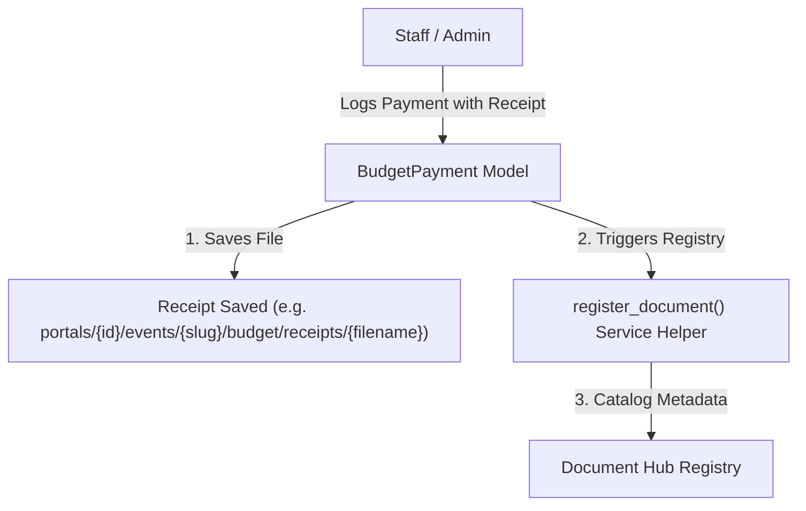

# Budgets App

The `budgets` app manages budget tracking, category-based cost allocation, and payment logs (including receipts) for client events.

---

## Architecture & Flow

The budget is scoped under an `Event`. Every event can have one `EventBudget` linked via a OneToOne relationship. 

### Budget Upload Integration with Document Hub

When payments are recorded against the budget, receipt files are stored using Django's file storage. The file metadata registry is synced with the central `Document` registry using the Document Catalog pattern.



---

## Models

### 1. `EventBudget`
One per event — the financial overview (Overview tab tiles).
* **event**: OneToOneField to `events.Event`.
* **total_budget**: DecimalField, staff-set.
* Computed properties: `allocated` (sum of every category's `estimated_amount`),
  `spent` (sum of every category's `actual_amount`), `remaining`
  (`total_budget - spent`), `budget_health_percentage` (`spent / total_budget
  * 100`), `financial_status` (`not_set` / `on_track` / `over_budget` —
  `BudgetHealthStatus`), plus the Payment History summary tiles
  (`payments_made_total/count`, `payments_pending_total/count`).

### 2. `BudgetCategory`
One row per category in the "Budget by Category" table — **not** a lookup
table `BudgetPayment` points at; both models carry their own independent
`category` field using the same `BudgetCategoryName` choices.
* **budget**: ForeignKey to `EventBudget`.
* **category**: CharField, `BudgetCategoryName` choices (venue, catering,
  photography, decor, music, attire, stationery, souvenir, other). Unique
  per budget — one row per category per event.
* **estimated_amount** / **actual_amount**: DecimalFields.
* **notes**: staff-written note surfaced as "View Note" on the category row.
* `variance` property: `actual_amount - estimated_amount` — **positive =
  over budget (red)**, negative = under budget (green). Verified against the
  Figma's worked example row by row; get this sign backwards and every
  category's color-coding on the frontend inverts.

### 3. `BudgetPayment`
One row per entry in the Payment History table.
* **budget**: ForeignKey to `EventBudget`.
* **category**: CharField, same `BudgetCategoryName` choices as
  `BudgetCategory` — independent value, not a FK to a specific category row
  (a payment can be tagged a category even if that category has no
  `BudgetCategory` row of its own yet).
* **payment_date**, **vendor_item**, **purpose**, **amount**.
* **status**: `PaymentStatus` choices (`paid` / `pending`).
* **receipt**: FileField (`budget_receipt_upload_path` →
  `portals/{portal_id}/events/{slug}/budget/receipts/`), also registered in
  the central Document Hub registry — see below.

---

## Integrating with the Documents Registry

When logging or modifying a payment with a receipt, the budgets app registers the receipt reference in the documents app:

```python
from apps.documents.services import register_document
from apps.documents.models import DocumentCategory

# Extract engagement from event
engagement = payment.budget.event.engagement  # Event -> EventEngagement (OneToOne)

if payment.receipt and engagement:
    register_document(
        engagement=engagement,
        source_instance=payment,
        file_path=payment.receipt.name,           # Saved relative path
        category=DocumentCategory.RECEIPT,
        uploaded_by=request.user,
        file_size=payment.receipt.size,
        mime_type=getattr(payment.receipt.file, "content_type", "application/pdf"),
    )
```

---

## Payment History pagination shape

Unlike most lists in this project, Payment History is genuinely **numbered-page**
shaped in the Figma ("Showing 1 to 7 of 14"), so it uses
`core.pagination.StandardPageNumberPagination` (default `page_size=7`) rather
than the cursor pagination used elsewhere. The payments themselves are nested
**inside** the summary payload, not returned as a bare list:

```jsonc
{
  "id": "<budget-uuid>",
  "payments_made_total": "4000000.00", "payments_made_count": 5,
  "payments_pending_total": "1000000.00", "payments_pending_count": 1,
  "total_payments_amount": "5000000.00", "total_payments_count": 6,
  "payments": {
    "count": 14, "next": "http://.../payments/?page=2", "previous": null,
    "results": [ { "id": "...", "payment_date": "...", "vendor_item": "...", "...": "..." } ]
  }
}
```

This replaced an earlier version of `EventBudgetPaymentSummarySerializer` that
nested the **full unpaginated** payment list, which didn't match the numbered
table in the Figma and would have shipped every payment in one response.
Filters: `?status=paid|pending`, `?category=<BudgetCategoryName>`,
`?vendor_item=<substring>`, `?sort=oldest` (default newest).

---

## Tips & gotchas

- **Deleting a budget is gated.** `DELETE /event/<slug>/budget/update/` refuses
  with `confirmation_required` + an impact breakdown
  (`{categories, payments, total}`) when anything is attached; pass
  `?confirm=true` to go ahead. Same contract as `delete_event`.
- **Receipt blobs outlive the cascade.** Deleting a budget cascades to its
  categories and payments, but Django never deletes `FileField` blobs — a
  payment's uploaded receipt stays in storage. Sweep with
  `python manage.py cleanup_orphaned_documents`. Note that command deliberately
  **excludes** budget receipts from its document_hub pass (they live at
  `…/events/<event>/budget/receipts/`), so they're only removed as registry
  orphans.
- **Money must go through `parse_decimal`.** Views read amounts straight off
  `request.data`, where a JSON string or float would blow up arithmetic against
  a `Decimal` model property with a `TypeError` instead of a clean 400. See
  `apps/core/utils.parse_decimal`.
- **`category` is a fixed vocabulary**, not free text — `venue`, `catering`,
  `photography`, `decor`, `music`, `attire`, `stationery`, `souvenir`, `other`.
- `financial_status` is derived (`not_set` / `on_track` / `over_budget`), so
  seeding a category whose `actual_amount` exceeds the total is the quickest way
  to exercise the over-budget path.
- Budgets hang off **`Event`**, not `EventEngagement` — unlike meetings,
  conversations, reminders and the document hub. A client with two events has
  two independent budgets.
