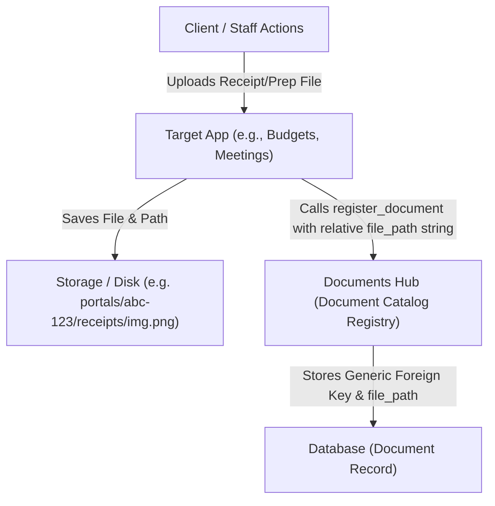

# Documents App

The `documents` app acts as a centralized metadata catalog for all files uploaded across the system, rather than acting as a storage manager. 

## The Registry Catalog Pattern

Instead of storing multiple copies or holding direct files, the `Document` model acts as a **registry lookup registry**. Apps that handle file uploads (e.g., budget receipts, meeting prep file uploads, contact photos) store the file on their own model using standard Django `FileField`/`ImageField` fields with custom upload paths. 

Once the file is successfully saved, `register_document()` is called, registering a reference to the saved path string inside the `Document` registry table. This architecture decouples apps while allowing the system to query all files across an engagement in a single centralized endpoint.

### File and Document flow

---

## Models

### `Document`
A single catalog registry record:
* **engagement**: ForeignKey to `EventEngagement`. Associates the document with a specific planning workspace.
* **uploaded_by**: ForeignKey to `User` (nullable, SET_NULL). Tracks who performed the upload.
* **category**: CharField using `DocumentCategory` choices:
  - `event_cover`: Event cover graphics.
  - `event_image`: Event day visuals.
  - `prep_upload`: Files uploaded in response to prep/meeting items.
  - `contact_photo`: Client contact avatar or photo.
  - `team_photo`: Team member photo.
  - `invoice`: Budget / invoice document.
  - `receipt`: Payment receipts.
* **content_type** & **object_id** & **source**: Django ContentTypes Generic ForeignKey. Links the document back to the source instance that created/owns it (e.g., `PrepItemFileUpload`, `BudgetPayment`).
* **file_path**: CharField storing the relative path string of the saved file (e.g. `portals/123/meetings/4/prep/5/image.png`).
* **filename**: Original filename.
* **file_size**: Size in bytes.
* **mime_type**: MIME category (e.g. `application/pdf`).

---

## Business Logic (`services.py`)

* **`register_document(engagement, source_instance, file_path: str, category, uploaded_by=None, file_size=None, mime_type="")`**:
  Standard helper method to register or update a document registry entry. Resolves the Django `ContentType` of the `source_instance` automatically and writes/updates the `Document` entry defaults.

---

## Serializers

* **`DocumentSerializer`**:
  Defines the serialized payload. Resolves absolute URL dynamically using `default_storage.url(obj.file_path)` and includes the uploader's email.

---

## Tips & gotchas

- **This app has no write endpoints.** Rows are created internally by
  `services.register_document(...)`, called from the flows that actually produce
  a file (meeting prep uploads, event covers, contact photos). `GET /documents/`
  is the only route.
- **Don't confuse it with `document_hub`.** This is the internal, generic-FK
  registry for media produced as a *side effect*; `document_hub` holds
  client-facing, staff-authored records (agreements, invoices, receipts) with
  their own lifecycle and reference codes.
- **`object_id` is a `CharField`, not an integer**, because the generic FK has to
  point at both int-PK and UUID-PK models. Don't "tidy" it to a
  `PositiveIntegerField`.
- **Deletion is signal-driven.** Django can't cascade a generic FK, so deleting a
  source object (e.g. a prep upload) relies on a `post_delete` receiver to call
  `unregister_document` and remove the blob — see `apps/meetings/signals.py`.
  Anything that slips through is swept by
  `python manage.py cleanup_orphaned_documents --dry-run`.
