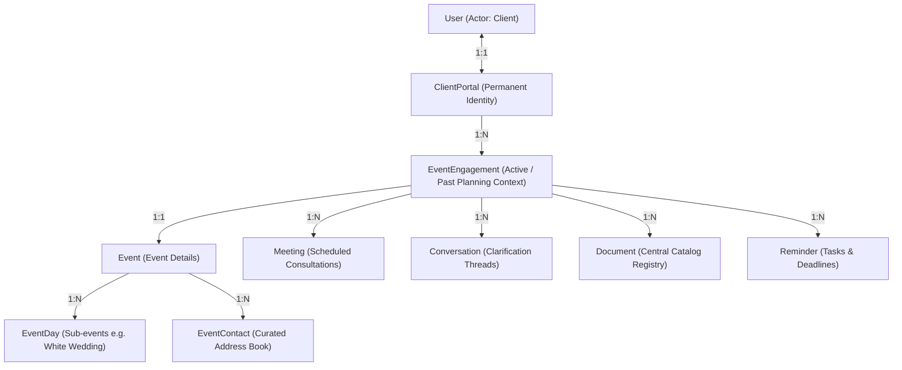

# Portal App

The `portal` app manages the client's planning dashboard. It acts as the orchestration layer and single source of truth for the client's overall journey in the application.

---

## Core Ideology: Portal Phase vs. Meeting Phase

The portal phase (`current_phase` on `ClientPortal`) and individual meeting `phase` fields are distinct components that work together to structure the client journey:

### 1. Portal `current_phase` — The Client's Overall Journey Position

This is the single source of truth for where the client currently is in their planning process. It controls:
- **Progress Bar:** Determines which step is highlighted on the client's Overview page.
- **Q&C Default:** Specifies which conversation threads are surfaced by default in Questions & Choices.
- **Content Locking:** Manages locked vs. unlocked content access based on their current stage.
- **Contextual Guidance:** Changes the instructional or guidance text shown on the Overview page.

### 2. Meeting `phase` — Organisation Label

This is simply a metadata label indicating which phase a meeting belongs to (e.g., "This meeting was created as part of the Connect phase"). It does **not** restrict access. It exists purely so meetings can be grouped, organized, and filtered.

### How They Work Together

```
Portal current_phase = "curate"
                │
                ├── Shows Curate as active on progress bar
                ├── Q&C defaults to Curate conversations
                └── Meetings filter → phase="curate" meetings are most relevant

Meetings in portal:
    ├── phase="connect"    → past meetings, still viewable
    ├── phase="align"      → past meetings, still viewable
    ├── phase="curate"     → current meetings, highlighted
    └── phase="envision"   → future meetings, visible but not yet active
```

- **Staff Action:** Staff advances the portal phase when the client moves to a new stage of planning — this is the overall progress indicator.
- **Individual Meetings:** Tagged with whichever phase they were created in. All meetings remain accessible to the client regardless of the current portal phase.

---

## Architecture & Relationships

Hephzibah Luxe backend follows a structured client-event separation architecture.

### Actors & Access
1. **Admin / Staff (Hephzibah Luxe Team):** Superusers or staff members. They manage multiple client portals, assign team members, advance planning phases, create/manage meetings, and lock/unlock client inputs.
2. **Client:** The celebrant user. They have access to exactly one `ClientPortal` where they view their active event details, complete prep checklists, respond to questions, and view conversations/meetings.

### Model Relationships & Lifetime Flow



* **ClientPortal:** The permanent client account identity. Created once when the client registers and remains unchanged. It has no direct event-planning state or phases.
* **EventEngagement:** The bridge between a portal and a specific event. It owns the planning state: the `current_phase`, `contacts_locked` status, and `phase_details`. A portal can have multiple engagements over a client's lifetime (e.g. Wedding, Anniversary), but only one is marked `is_active=True`.
* **Lifetime Flow:** When a client returns for a new event, `activate_engagement(portal, new_event)` is called. The previous engagement is deactivated (`is_active=False`). Historical data remains associated with the past engagement and event in the database but is no longer surfaced in the active client portal view.

---

## Models

### 1. `ClientPortal`

One record per client user. Represents their dashboard environment identity.

| Field | Type | Purpose |
|---|---|---|
| `id` | UUID | Primary key |
| `user` | OneToOne → User | The client this portal belongs to |
| `welcome_message` | TextField | Custom welcome message shown on the client dashboard |

**Properties:**
* `active_engagement` -> Returns the currently active `EventEngagement` (where `is_active=True`).
* `active_event` -> Helper property pointing to `active_engagement.event`.
* `current_phase` -> Helper property pointing to `active_engagement.current_phase`.

### 2. `EventEngagement`

Represents one specific active planning job context for a client's event.

| Field | Type | Purpose |
|---|---|---|
| `id` | UUID | Primary key |
| `portal` | ForeignKey → `ClientPortal` | The parent client portal |
| `event` | OneToOne → `events.Event` | The event being planned |
| `is_active` | Boolean | True if this is the active workspace; only one active engagement per portal is allowed |
| `current_phase` | CharField (choices) | Current phase of the planning journey |
| `phase_details` | JSONField | Sub-status metadata/checklist state for each phase |
| `contacts_locked` | Boolean | If True, client editing for contacts is disabled |

**Planning phases** (`PlanningPhase`):
1. `connect` — No. 01: Connect
2. `align` — No. 02: Align
3. `curate` — No. 03: Curate
4. `envision` — No. 04: Envision
5. `orchestrate` — No. 05: Orchestrate
6. `deliver` — No. 06: Deliver

### 3. `TeamMember`

Profiles of Hephzibah Luxe planning staff shown on client portals (e.g. Winnie, Tosin). Master list. The `is_default` flag marks a member as one of the **auto-seeded "Meet Your Team" contacts** — see below.

### 4. `PortalTeamAssignment`

Maps which `TeamMember` profiles are assigned to which `ClientPortal`.

### Default team members (auto-seeded)

Members flagged `is_default` are **auto-assigned to every new portal** when it is
created (`services.seed_default_team_members`, fired by a `ClientPortal`
`post_save` signal) — the two founders shown under "Meet Your Team" no longer
need manual assignment per client. Mirrors the welcome-message / default-document
seeding:

- **New portals only** — existing portals keep their current manual assignments.
- **Idempotent**, and fires only on creation, so a member staff removed from a
  portal isn't silently re-added.
- Staff set/clear `is_default` through the existing team-member endpoints
  (`POST /team-members/`, `PATCH /team-members/<id>/`) and the Django admin;
  `GET /team-members/?is_default=true` lists just the defaults.

> Note: this is boilerplate-style seeding (same contacts for everyone). Per-transaction
> records like **invoices/receipts are deliberately NOT auto-seeded** — they're
> created on demand (see `apps/document_hub`).

---

## Setting Active Engagement & Switching Events

Event switching and engagement progression is managed through dedicated services in `services.py`. To activate an event engagement:
1. `activate_engagement(portal, event)` is called.
2. The service atomically deactivates any existing active engagement for the portal and gets-or-creates an `EventEngagement` marked as active.
3. This decouples past events from the active workspace without deleting historical data.

---

## Serializers

### `PortalOverviewSerializer` — read-only client view

Returned by `GET /portal/` and also after any staff write operation (as the confirmation response). Fields:

| Field | Source | Notes |
|---|---|---|
| `id` | model | Portal UUID |
| `title` | `get_title()` | `active_event.title` or `null` |
| `active_event` | model FK | Raw event PK |
| `welcome_message` | model | Custom text from staff |
| `current_phase` | model | Phase slug e.g. `"curate"` |
| `current_phase_display` | `get_current_phase_display` | Human label e.g. `"No. 03: Curate"` |
| `phase_details` | model | JSON sub-status dict |
| `team` | `get_team()` | List of assigned `TeamMember` objects (name, role, bio, photo) |
| `contact` | `get_contact()` | Hephzibah Luxe contact info from `PortalSettings.contact_email` / `contact_whatsapp` |
| `contacts_locked` | model | Whether clients can self-edit their contacts |
| `created_at`, `updated_at` | model | Timestamps |

`contact` backs the client portal's "Contact Your Team" — Send an Email /
Send a Message (the frontend builds `mailto:`/`wa.me` links from these two
fields directly; no conversation is created by opening that panel — see
`apps/conversations/README.md` for how staff logs the resulting exchange
afterward). Admin-configurable (`PortalSettings`, no API) — same
no-redeploy-needed reasoning as auto-lock and the notification debounce
below. Used to be `settings.HEPHZIBAH_CONTACT` (env-sourced); moved here so
changing a support inbox or WhatsApp number doesn't require a deploy.

### `PortalUpdateSerializer` — staff write

Used for `PATCH /portal/`. Only exposes `welcome_message` and `active_event`. Validates that the event belongs to the portal's client.

### `PhaseUpdateSerializer` — phase input

Input-only. Accepts a `phase` choice field. Used by `update_phase` when `advance` is not set.

### `AssignTeamMemberSerializer` — team assignment input

Input-only. Accepts `team_member_id` (UUID) and validates it exists in the DB.

---

## Services (`services.py`)

All business logic for staff-controlled portal operations:

| Function | What it does |
|---|---|
| `advance_phase(portal)` | Moves to the next phase in `PHASE_ORDER`. Raises `ValidationError` if already at `deliver`. |
| `set_phase(portal, new_phase)` | Directly sets the phase to any valid value. |
| `assign_team_member(portal, team_member_id)` | Assigns a `TeamMember` to the portal. No-ops silently if already assigned. |
| `remove_team_member(portal, team_member_id)` | Removes a team member from the portal. Raises `ValidationError` if not assigned. |

---

## Contacts lock

When `EventEngagement.contacts_locked` is `true`, clients get a `403`
(`code=contacts_locked`) if they try to add or edit a contact. Staff can
always write contacts regardless of the lock. See `apps/contacts/README.md`
and the "Phase attribution & auto-lock" section below for how the lock gets
set (manually, or automatically at a configured phase).

---

## Phase attribution & auto-lock

- **Attribution:** `EventEngagement.phase_updated_by` / `phase_updated_at` record
  who changed the planning phase and when (set in `services.set_phase` /
  `advance_phase`, which now take a `user`). Surfaced on the portal overview /
  event-detail aggregate as `phase_updated_by_display` — drives the Planning
  Stage "Last Updated by …".
- **Auto-lock (`PortalSettings` singleton, admin-only, no API):** when
  `auto_lock_enabled` is on, an engagement's `event_details_locked` and/or
  `contacts_locked` are set automatically once its phase reaches `auto_lock_phase`
  (or later) — the Figma "editing restricted during later stages" behaviour.
  Configurable: the master switch, the trigger phase, and which of the two locks
  to apply. **Lock-on-reach only** — it never auto-unlocks; staff can still unlock
  manually. Implemented in `services._apply_auto_lock`, called on every phase
  change.

## Design Decisions & Gotchas

1. **`active_event` is staff-set, not auto-assigned.** Creating an event doesn't automatically make it active on the portal. Staff must explicitly pin it via `PATCH /portal/`.

2. **`contacts_locked` lives on `ClientPortal`, not on `Event`.** This is intentional — it's a staff-level decision about the planning workflow state, not an event-level property.

3. **`get_portal()` has two modes** — if `?portal_id=` is in query params it's a staff lookup; if not, it derives the portal from `request.user`. This means a client can never see another client's portal even if they somehow know the UUID.

4. **`update_portal()` always returns the full `PortalOverviewSerializer` response**, not just the updated fields. This keeps the frontend in sync without needing a second GET call.

5. **Team members are global, not portal-specific.** A `TeamMember` is created once and can be assigned to many portals. Deleting a `TeamMember` cascades and removes all their assignments.

---

## Tips & gotchas (attribution & lifecycle)

- **`phase_updated_by` is not the generic attribution.** `EventEngagement`
  carries both: `phase_updated_by`/`phase_updated_at` track *specifically* who
  moved the planning phase and when, while `created_by`/`last_updated_by` (from
  `core.AttributedModel`) move on any save — a lock toggle, a rename, anything.
  Keep using the phase pair for the "Last Updated by" line on the Planning Stage;
  it's the only one that stays put when something unrelated changes.
- **Portals are created by a signal**, not by an endpoint, so a `ClientPortal`
  usually has a **null `created_by`** — there's no acting request user at
  registration time. That's expected, not a bug.
- **Deactivating a client does not touch their portal.** Offboarding is a
  reversible `is_active` flip (see `apps/accounts/README.md`); the portal,
  engagements and all their content survive untouched, which is exactly why the
  user is never deleted.
- **`PortalTeamAssignment` has two admin surfaces**: the inline on
  `ClientPortal` (assign while looking at a client) and a standalone admin for
  the reverse question — "which portals is this team member on?" — which an
  inline can't answer.
